# The Dark Knight — Team Current | WRO Future Engineers 2026

> **A reproducible self-driving vehicle developed for WRO Future Engineers 2026**

[](https://github.com/darsh-makadia/Team-Current-WRO-FE-2026)
[](#hardware-and-system-overview)
[](#software-architecture)
[](#wro-challenges)

---

## Contents

- [About the Project](#about-the-project)
- [The Team](#the-team)
- [Final Robot](#final-robot)
- [Hardware and System Overview](#hardware-and-system-overview)
- [Mechanical Design](#mechanical-design)
- [Drivetrain and Differentials](#drivetrain-and-differentials)
- [Steering](#steering)
- [Camera System and Perception](#camera-system-and-perception)
- [Computer Vision Pipeline](#computer-vision-pipeline)
- [Software Architecture](#software-architecture)
- [Open Challenge](#open-challenge)
- [Obstacle Challenge](#obstacle-challenge)
- [Parking Development](#parking-development)
- [Power and Electronics](#power-and-electronics)
- [Testing and Validation](#testing-and-validation)
- [Engineering Evolution](#engineering-evolution)
- [Quick Start](#quick-start)
- [Repository Structure](#repository-structure)
- [Reproducibility](#reproducibility)
- [Evidence Index](#evidence-index)
- [Configuration Consistency](#configuration-consistency)
- [Version and Release](#version-and-release)

---

# About the Project

**The Dark Knight** is Team Current's WRO Future Engineers 2026 self-driving vehicle. The project combines a custom mechanical platform, Raspberry Pi-based control, dual Raspberry Pi Camera Module 3 cameras, colour-based computer vision, an MPU6050 IMU, custom 3D-printed components, and Python software for autonomous navigation.

The robot was developed through multiple mechanical and software iterations rather than as a single fixed design. The repository preserves the final configuration together with the engineering evidence needed to understand how the robot was built, why important design decisions were made, and how the resulting system was tested.

The repository is organised as a connected engineering record:

> **Problem → hypothesis → change → test → measured result → decision**

A judge or another team can begin with this README, follow the construction and setup guides, inspect the source code and CAD/STL files, and then review the photographs, measurements, testing records, engineering evolution, and video evidence.

**Repository:** [Team-Current-WRO-FE-2026](https://github.com/darsh-makadia/Team-Current-WRO-FE-2026)

---

# The Team

<table>
<tr>
<td width="25%" align="center">


### Darsh Makadia
**Team Member**

Mechanical design, hardware integration, software development, testing, and overall robot integration.

</td>
<td width="25%" align="center">


### Ehan Mansuri
**Team Member**

CAD design, mechanical development, manufactured components, and robot design integration.

</td>
<td width="25%" align="center">

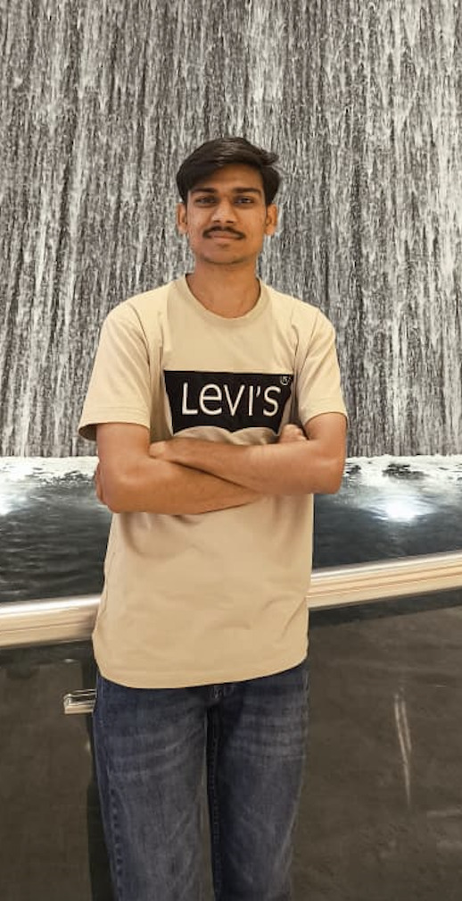

### Sunil Solanki
**Coach**

Electrical systems, mechanical guidance, software development, and technical integration guidance.

</td>
<td width="25%" align="center">

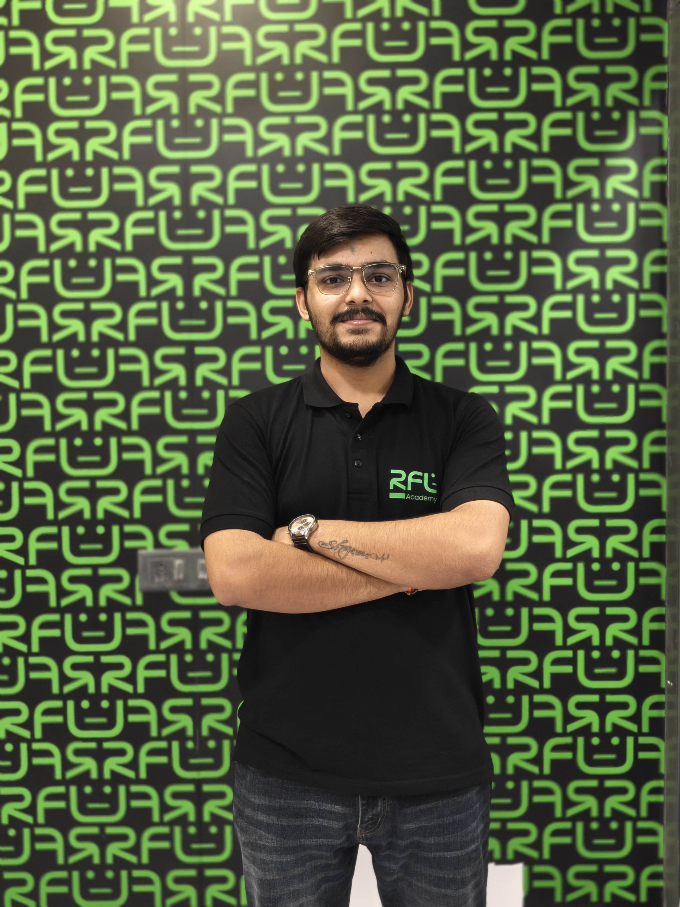

### Shyam Satasiya
**Coach**

CAD guidance and support for mechanical design and manufactured components.

</td>
</tr>
</table>

<p align="center">

</p>

---

# Final Robot

The final robot uses a custom 3D-printed chassis and integrates the drivetrain, steering system, cameras, Raspberry Pi, motor electronics, IMU, battery, and electronics enclosure into a compact vehicle.

<table>
<tr>
<td width="33%" align="center">
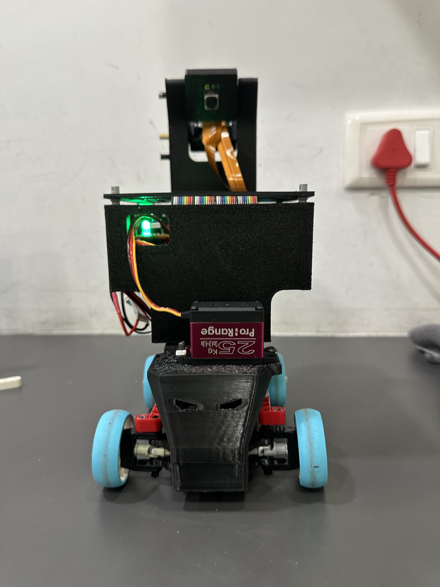
<br><b>Front view</b>
</td>
<td width="33%" align="center">
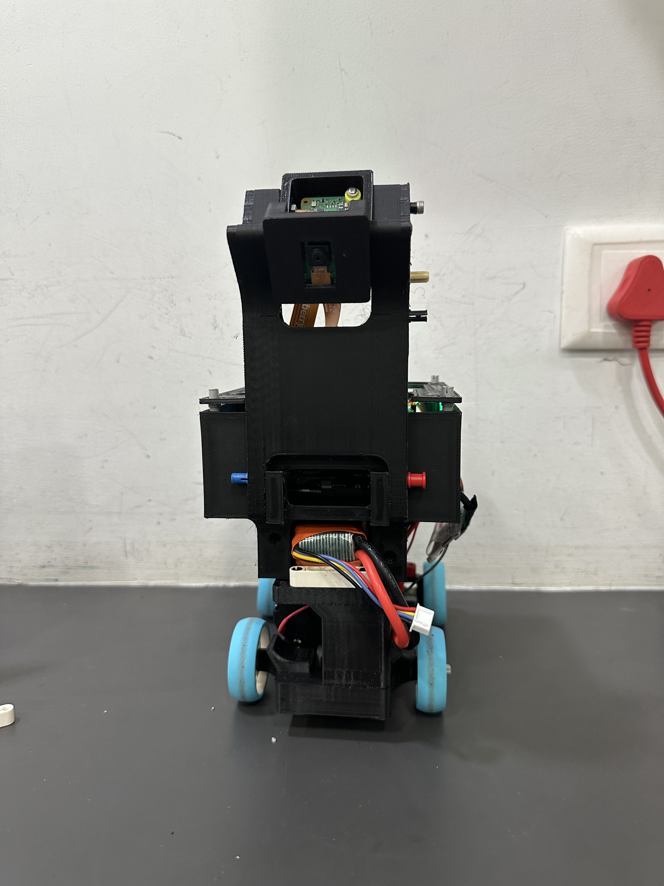
<br><b>Rear view</b>
</td>
<td width="33%" align="center">
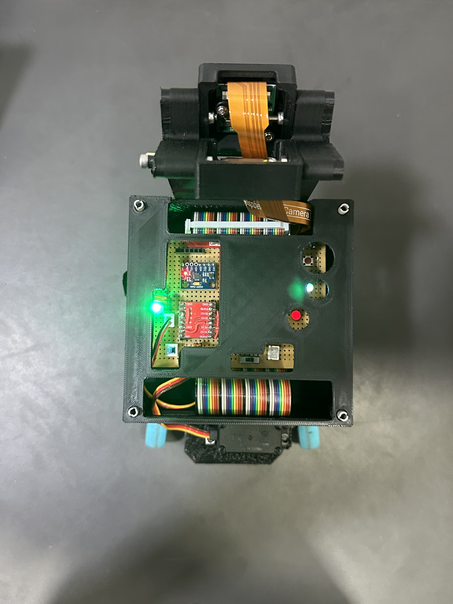
<br><b>Top view</b>
</td>
</tr>
</table>

<table>
<tr>
<td width="50%" align="center">
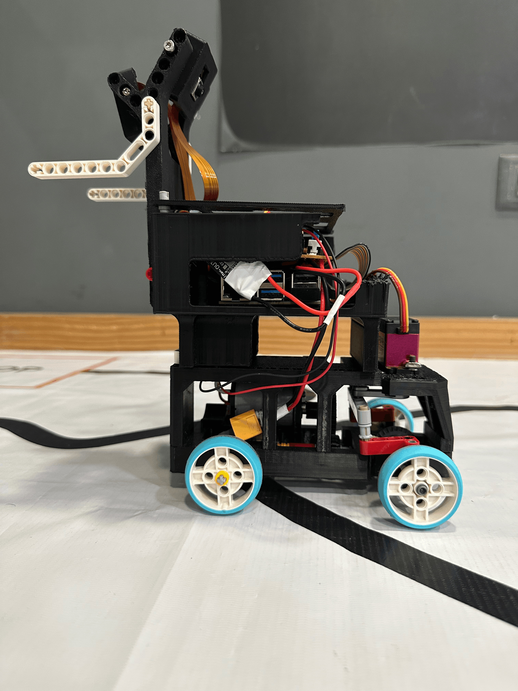
<br><b>Side profile 1</b>
</td>
<td width="50%" align="center">
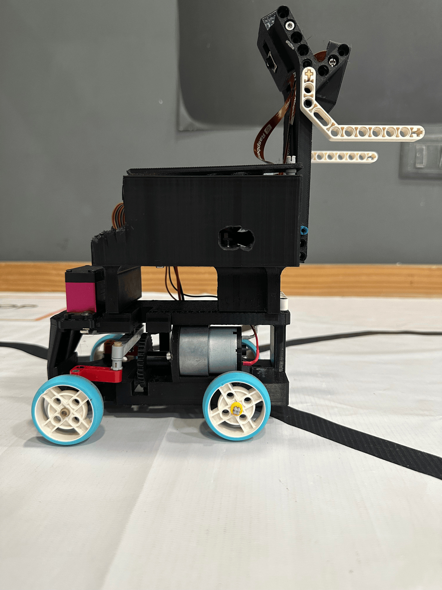
<br><b>Side profile 2</b>
</td>
</tr>
</table>

## Development history

The final configuration was reached through earlier prototypes.

<table>
<tr>
<td width="50%" align="center">
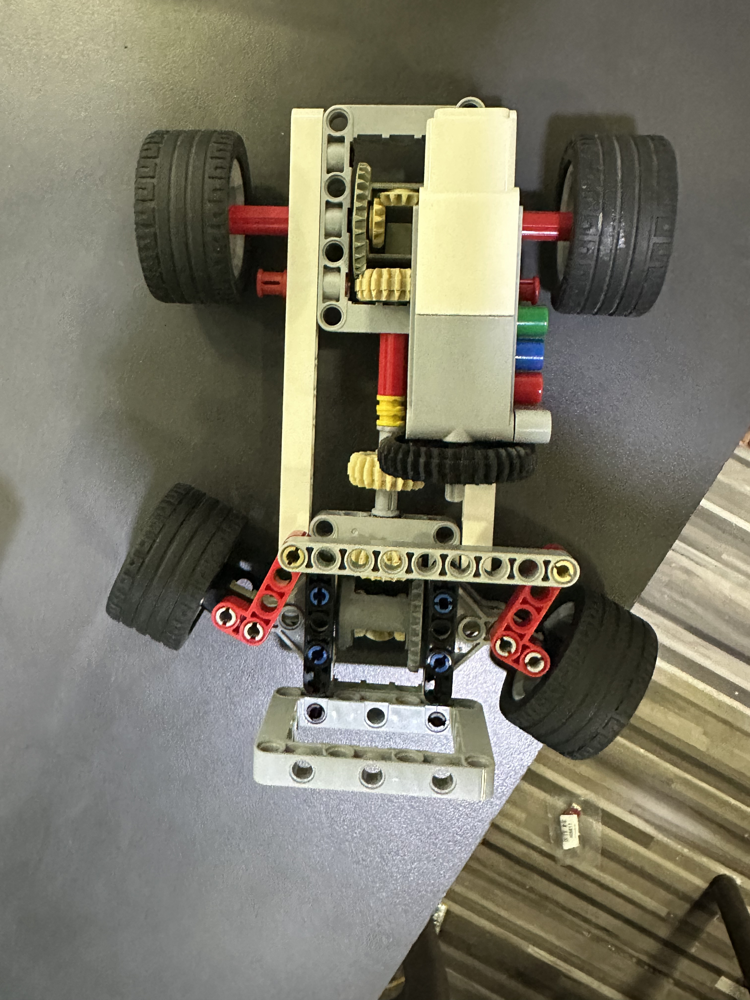
<br><b>Version 1 — LEGO-heavy development platform</b>
</td>
<td width="50%" align="center">
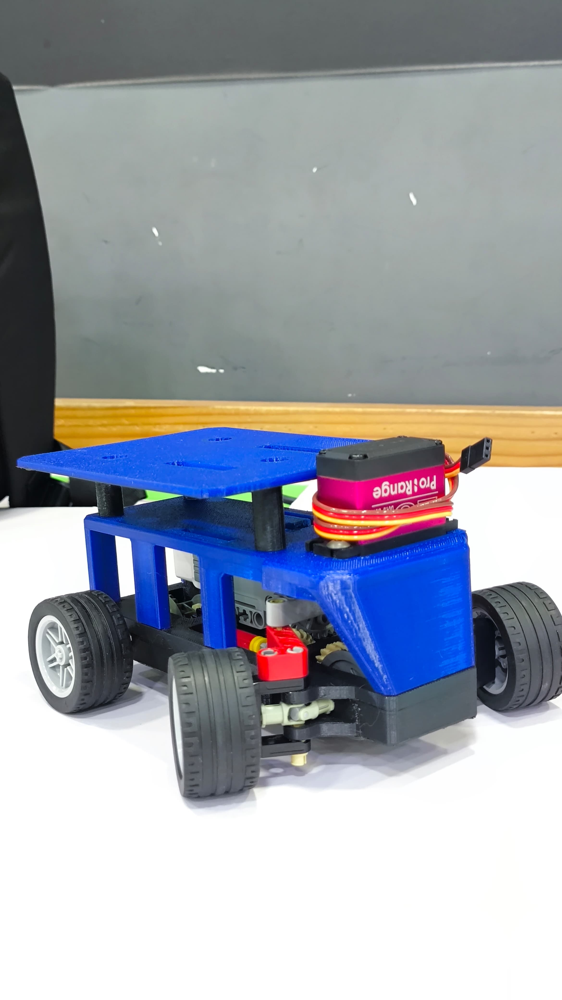
<br><b>Version 2 — LEGO/CAD hybrid platform</b>
</td>
</tr>
</table>

The progression from a LEGO-heavy prototype to a hybrid platform and then to the final custom chassis is documented in [`testing/engineering_evolution.md`](testing/engineering_evolution.md).

---

# Hardware and System Overview

The robot's main hardware architecture combines:

| Subsystem | Implementation |
|---|---|
| Main computer | Raspberry Pi 5 |
| Cameras | Two Raspberry Pi Camera Module 3 cameras |
| Vision processing | OpenCV-based colour segmentation and contour analysis |
| Heading sensing | MPU6050 through I2C |
| Drive | JGB37-520 DC drive motor |
| Steering | Servo-operated steering mechanism |
| Drivetrain | Central drive arrangement with two axle differentials |
| Battery | 11.1 V battery system |
| Custom components | 3D-printed chassis, camera mount/case, electronics enclosure, and 36-tooth gear |

The exact components and purchase references are documented in [`guide/PARTS_AND_PURCHASE_LINKS.md`](guide/PARTS_AND_PURCHASE_LINKS.md). The construction process is documented in [`guide/BUILD_FROM_ZERO.md`](guide/BUILD_FROM_ZERO.md).

---

# Mechanical Design

The final vehicle uses a custom printed chassis to provide a dedicated structure for the drivetrain, steering system, electronics, cameras, and battery.

## CAD and manufactured components

The final STL files are stored in [`models/`](models/). Their corresponding CAD previews are shown below.

<table>
<tr>
<td width="50%" align="center">
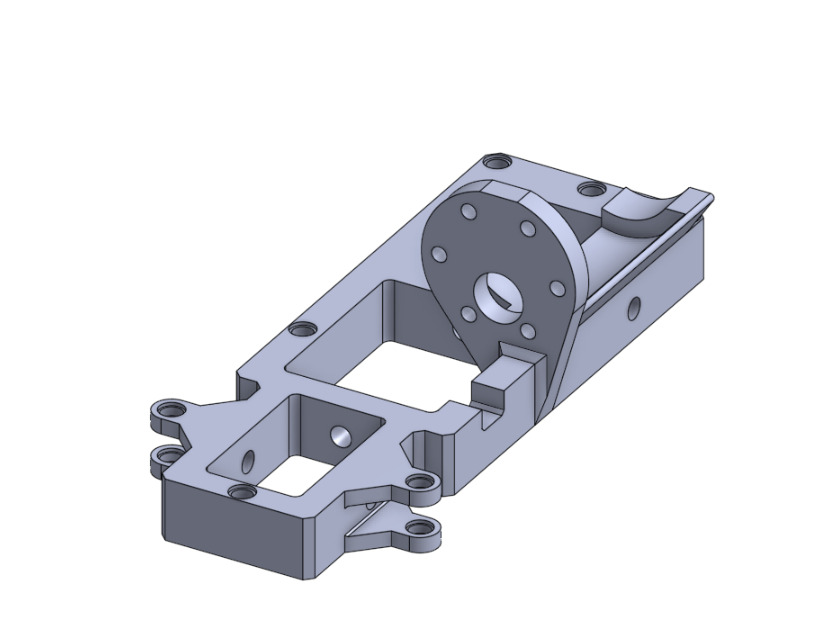
<br><a href="models/chassis.stl"><b>chassis.stl</b></a>
</td>
<td width="50%" align="center">
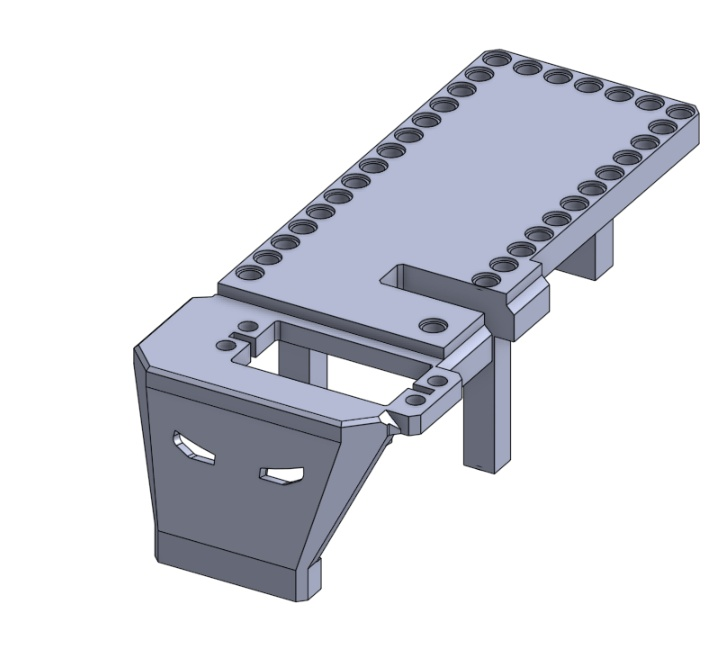
<br><a href="models/chassis%20pt2.stl"><b>chassis pt2.stl</b></a>
</td>
</tr>
<tr>
<td width="50%" align="center">
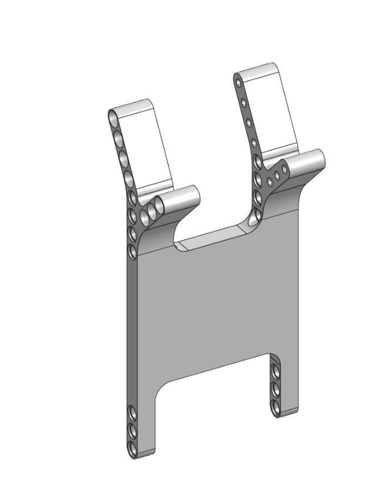
<br><a href="models/dual_camera_mount.stl"><b>dual_camera_mount.stl</b></a>
</td>
<td width="50%" align="center">
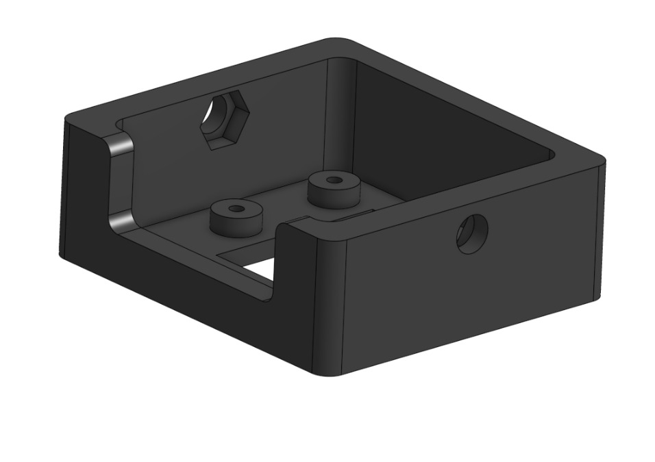
<br><a href="models/camera%20case.stl"><b>camera case.stl</b></a>
</td>
</tr>
<tr>
<td width="50%" align="center">
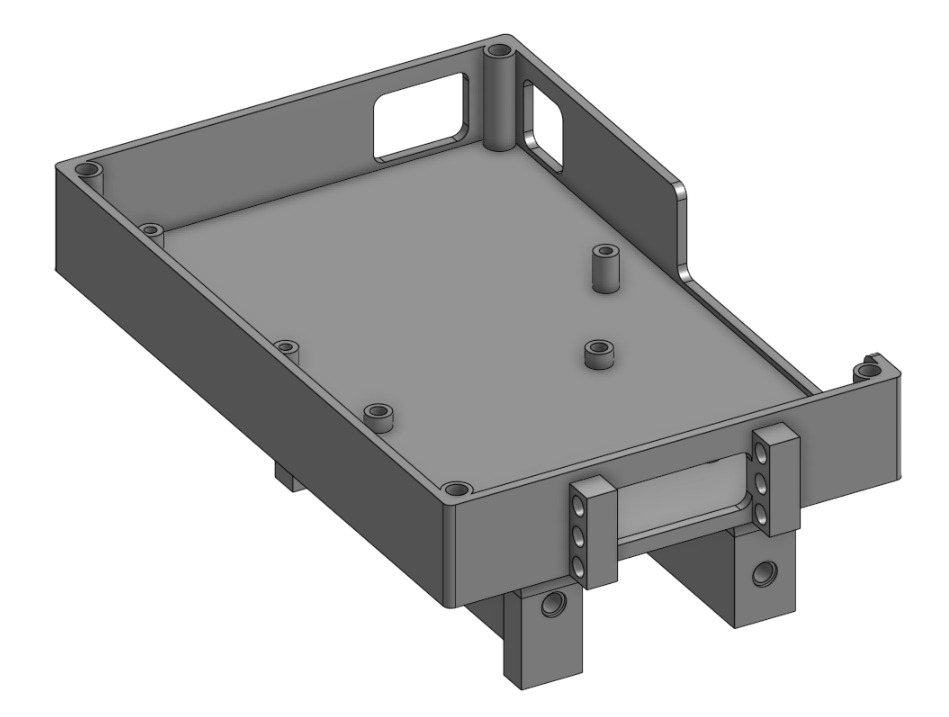
<br><a href="models/Circuit_Box.stl"><b>Circuit_Box.stl</b></a>
</td>
<td width="50%" align="center">

<br><a href="models/Circuit_Box_LID.stl"><b>Circuit_Box_LID.stl</b></a>
</td>
</tr>
<tr>
<td colspan="2" align="center">
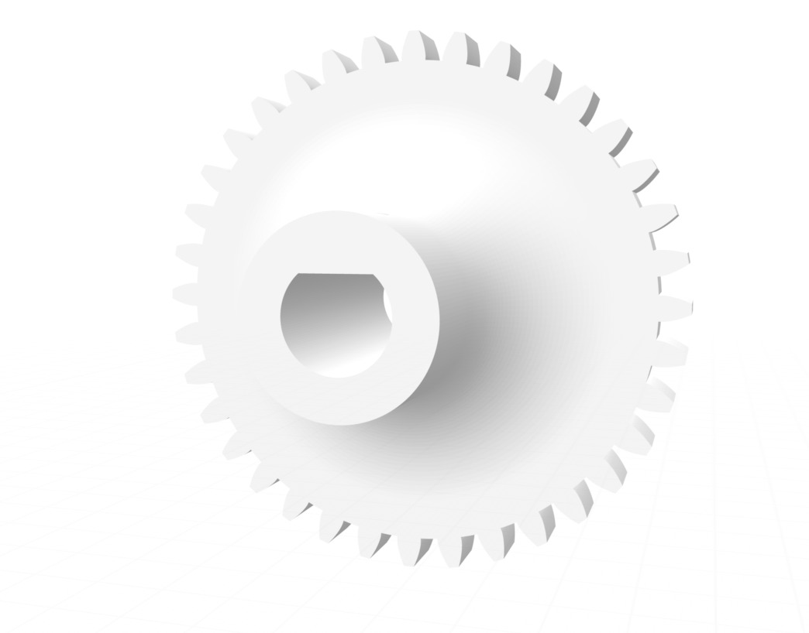
<br><a href="models/36t%20gear.stl"><b>36t gear.stl</b></a>
</td>
</tr>
</table>

Manufacturing settings for the printed components are documented in [`guide/3D_PRINTING_SETTINGS.md`](guide/3D_PRINTING_SETTINGS.md).

---

# Drivetrain and Differentials

The drivetrain uses a central mechanical power path that transfers motion to both axle assemblies. The system includes **two mechanical differentials**, one associated with each axle.

<p align="center">
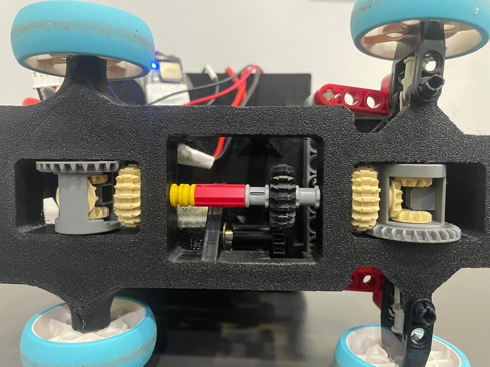
</p>

The central drivetrain arrangement transfers power through the chassis and distributes it to the axle assemblies.

<p align="center">
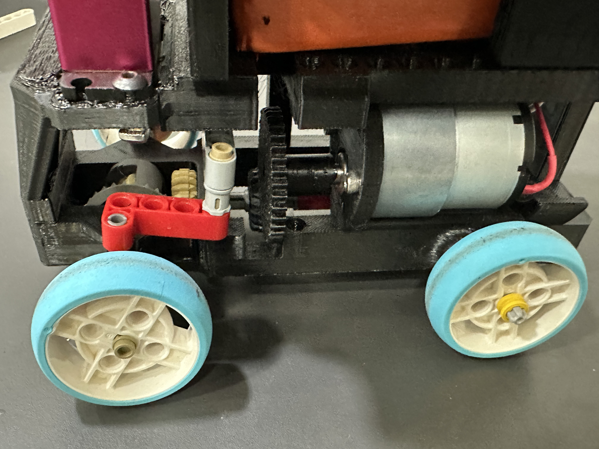
</p>

This design allows the drive system to transmit power to all four wheels while retaining differential action at the axle assemblies.

The final drivetrain and motor configuration should be interpreted together with:

- [`guide/BUILD_FROM_ZERO.md`](guide/BUILD_FROM_ZERO.md)
- [`guide/PARTS_AND_PURCHASE_LINKS.md`](guide/PARTS_AND_PURCHASE_LINKS.md)
- [`testing/engineering_evolution.md`](testing/engineering_evolution.md)

---

# Steering

Steering is controlled by a servo-driven mechanical linkage. The steering system was calibrated on the physical robot and integrated with the vehicle-control functions in [`src/drive.py`](src/drive.py).

<p align="center">
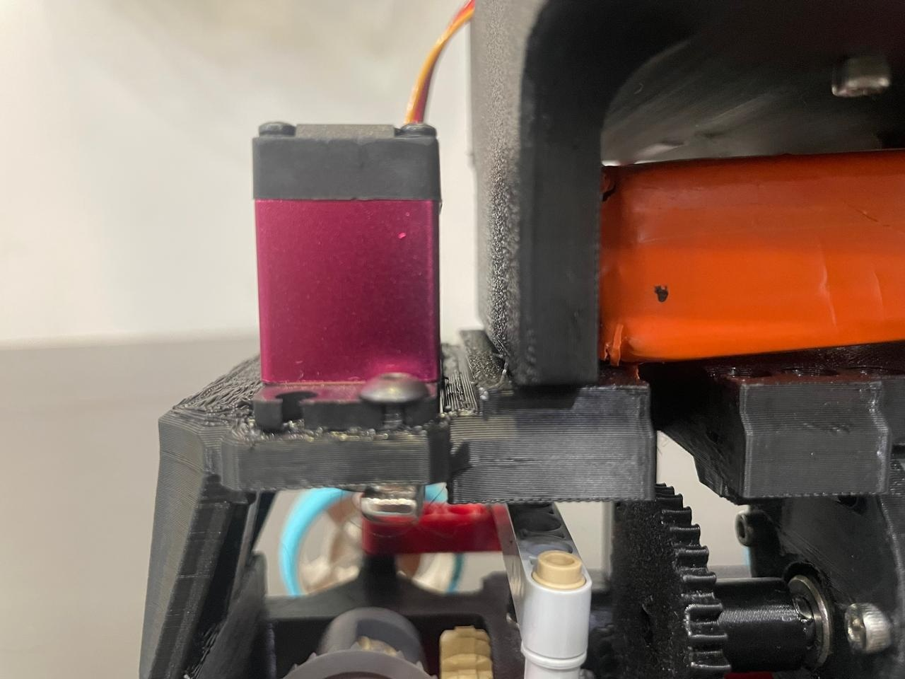
</p>

The software provides steering limits, movement commands, stop behaviour, and GPIO cleanup. Final steering values are controlled by the source configuration and should be verified against the physical robot before a new reproduction or competition configuration is called final.

The drive motor mounting arrangement is shown below.

<p align="center">
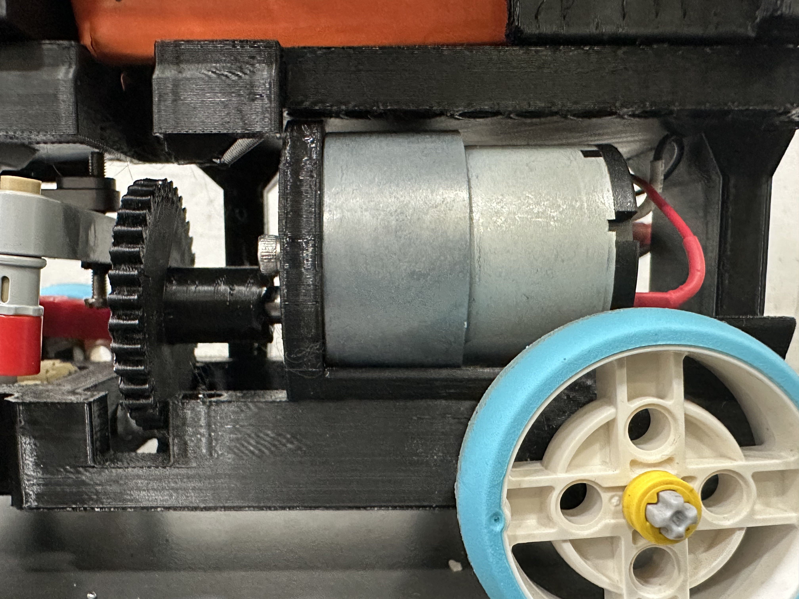
</p>

---

# Camera System and Perception

The robot uses two Raspberry Pi Camera Module 3 cameras for different perception tasks.

<p align="center">
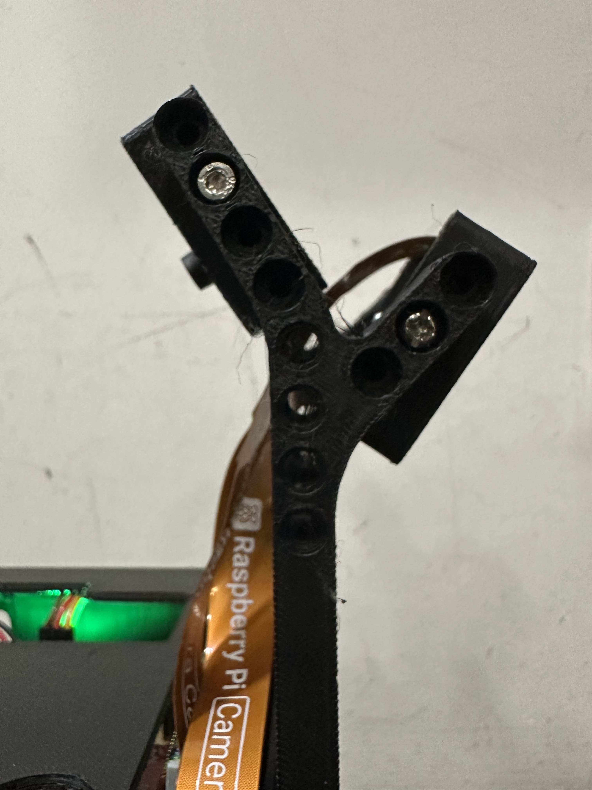
</p>

The camera mounting system was adjusted during development to obtain useful fields of view for challenge navigation and parking.

<p align="center">
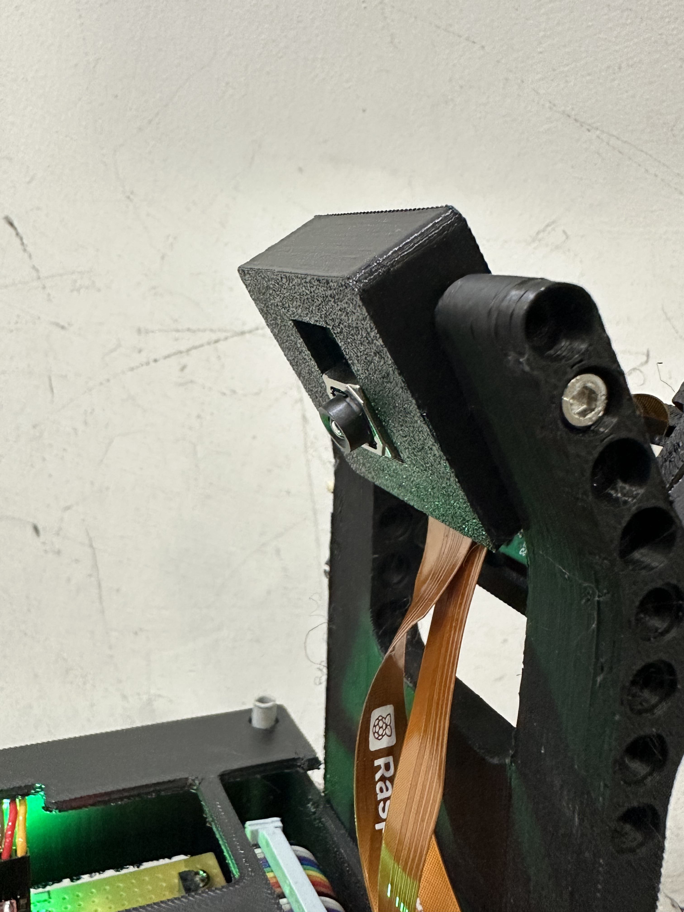
</p>

## Camera evidence

<table>
<tr>
<td width="33%" align="center">
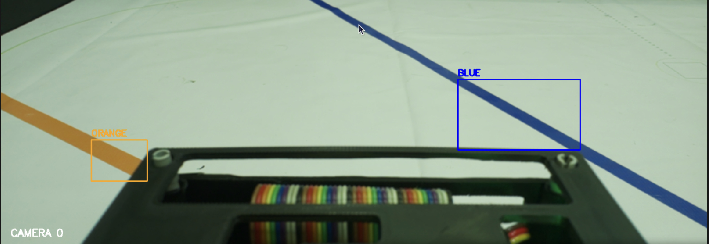
<br><b>Forward navigation view</b>
</td>
<td width="33%" align="center">
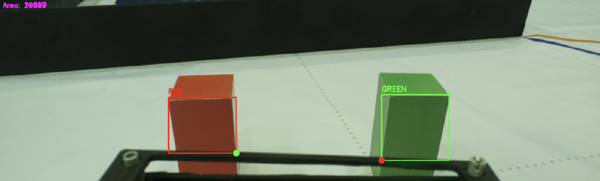
<br><b>Obstacle perception view</b>
</td>
<td width="33%" align="center">
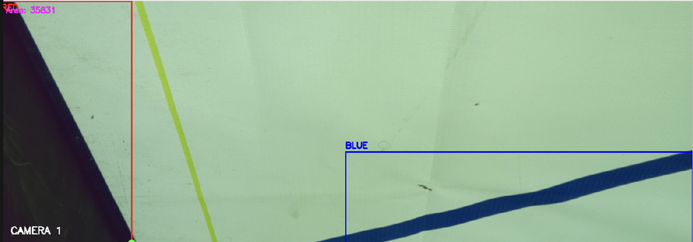
<br><b>Parking perception view</b>
</td>
</tr>
</table>

Both challenge programs currently use the front camera at **1480 × 520 pixels**. The configured target and the measured processing performance are kept separate: the target camera rate is not presented as identical to the observed end-to-end processing rate.

Camera and sensor configuration evidence is documented in [`guide/POWER_AND_SENSOR_EVIDENCE.md`](guide/POWER_AND_SENSOR_EVIDENCE.md).

---

# Computer Vision Pipeline

The vision implementation is based primarily on direct colour segmentation and contour analysis using OpenCV.

The shared processing sequence is:

```text
Camera frame
    ↓
HSV conversion
    ↓
Colour mask
    ↓
Morphological opening/closing
    ↓
Contour extraction
    ↓
Filtering / confidence logic
    ↓
Target point
```

## Open Challenge processing

The Open Challenge uses the relevant camera image and marker-processing logic to determine direction, detect and count markers, support wall following, and determine when the configured challenge sequence is complete.

The Open Challenge-specific vision implementation is contained in [`src/openVision.py`](src/openVision.py), while the main challenge program is [`src/Current_Open_8_22.py`](src/Current_Open_8_22.py).

## Obstacle Challenge processing

The Obstacle Challenge uses colour segmentation and contour processing to identify coloured obstacles and calculate the target information used by the challenge-control logic.

A black segmentation mask is used as evidence for track/boundary isolation:

<p align="center">
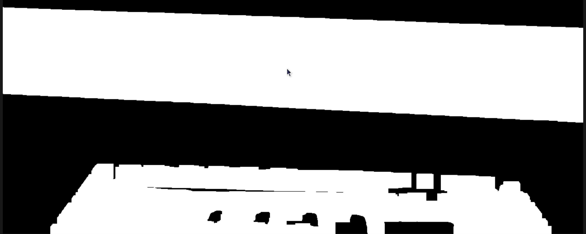
</p>

Contour processing and obstacle detection evidence are shown below.

<table>
<tr>
<td width="50%" align="center">

<br><b>Contour-processing output</b>
</td>
<td width="50%" align="center">

<br><b>Obstacle-detection output</b>
</td>
</tr>
</table>

The shared obstacle-processing implementation is contained in [`src/vision.py`](src/vision.py), while challenge behaviour is controlled by [`src/Current_Obstacle_8_21.py`](src/Current_Obstacle_8_21.py).

---

# Software Architecture

The repository contains the executable Python programs and reusable hardware/software modules in [`src/`](src/).

| File | Function |
|---|---|
| [`Current_Open_8_22.py`](src/Current_Open_8_22.py) | Open Challenge program, direction selection, marker detection/counting, wall following, steering, speed control, and stopping. |
| [`Current_Obstacle_8_21.py`](src/Current_Obstacle_8_21.py) | Obstacle Challenge program, colour-obstacle detection, direction-dependent avoidance, lap/parking transition, and completion behaviour. |
| [`drive.py`](src/drive.py) | Raspberry Pi GPIO motor control, PWM, forward/reverse movement, servo steering, steering limits, stop, and cleanup. |
| [`heading.py`](src/heading.py) | MPU6050 I2C communication, gyro-bias calibration, heading integration, and heading wrapping. |
| [`vision.py`](src/vision.py) | Shared camera processing, colour masks, morphology, contour detection, confidence logic, and target selection. |
| [`openVision.py`](src/openVision.py) | Open Challenge-specific vision processing. |
| [`parking.py`](src/parking.py) | Rear-camera parking detection, wall following, and IMU-guided parking actions. |

The GPIO implementation uses **`RPi.GPIO`**, as reflected by the source import:

```python
import RPi.GPIO as GPIO
```

The MPU6050 communicates through **I2C**.

The repository intentionally lists the actual source filenames rather than generic names such as `open_challenge.py` or `obstacle_challenge.py`. A reproducible configuration should always run and document the source files that actually exist in the final repository.

---

# WRO Challenges

## Open Challenge

The Open Challenge software is implemented in:

[`src/Current_Open_8_22.py`](src/Current_Open_8_22.py)

The program combines:

- direction selection;
- marker detection and counting;
- cooldown and duplicate-detection control;
- wall-following logic;
- steering control;
- speed control; and
- challenge completion/stopping behaviour.

The current source contains the final challenge parameters used for the repository baseline, including:

- `TOTAL_LINES = 13`
- `LINE_COOLDOWN = 1.2`
- `START_SPEED = 40`
- `TARGET_SPEED = 70`

These values should not be replaced in documentation by older values unless the source itself is changed and the resulting configuration is retested.

### Open Challenge evidence

<p align="center">
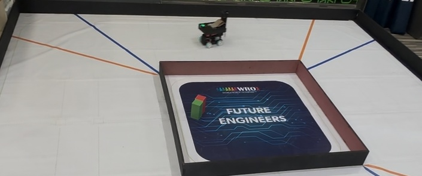
</p>

The repository also contains an Open Challenge video in [`testing/Open_Challenge.mp4`](testing/Open_Challenge.mp4) and additional video evidence in [`video/`](video/).

---

## Obstacle Challenge

The Obstacle Challenge software is implemented in:

[`src/Current_Obstacle_8_21.py`](src/Current_Obstacle_8_21.py)

The challenge program combines colour-based obstacle perception with direction-dependent navigation and vehicle control. Supporting functions are provided by the shared vision, drive, and heading modules.

<p align="center">
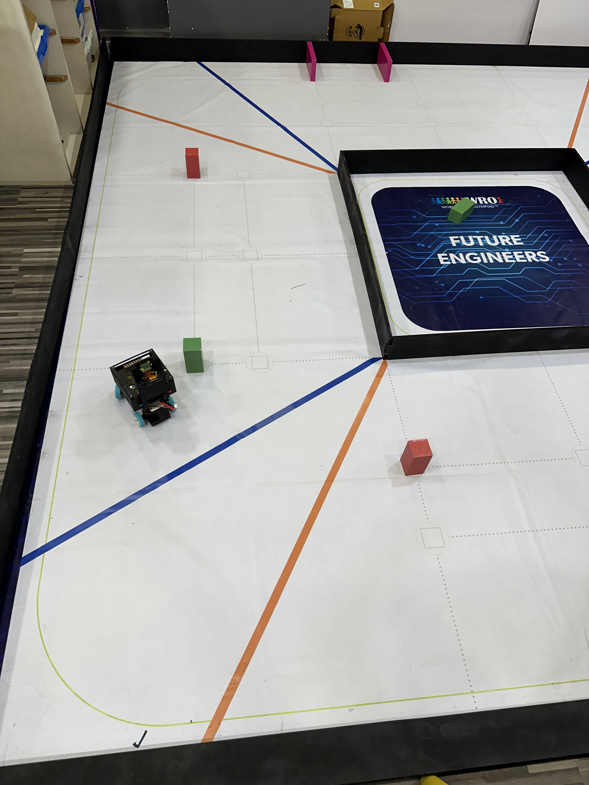
</p>

Individual challenge results and observations are stored in [`testing/test_results.csv`](testing/test_results.csv), with a readable summary in [`testing/test_summary.md`](testing/test_summary.md).

Measured processing observations are stored separately in [`testing/processing_observations.csv`](testing/processing_observations.csv). These observations should be interpreted according to the recorded robot configuration and test conditions rather than as a guarantee of an identical processing rate under every possible operating condition.

---

# Parking Development

Parking is an active engineering component of the robot and is represented by:

- [`src/parking.py`](src/parking.py)
- the rear-camera parking view;
- IMU-guided parking actions; and
- dedicated parking test evidence.

<p align="center">
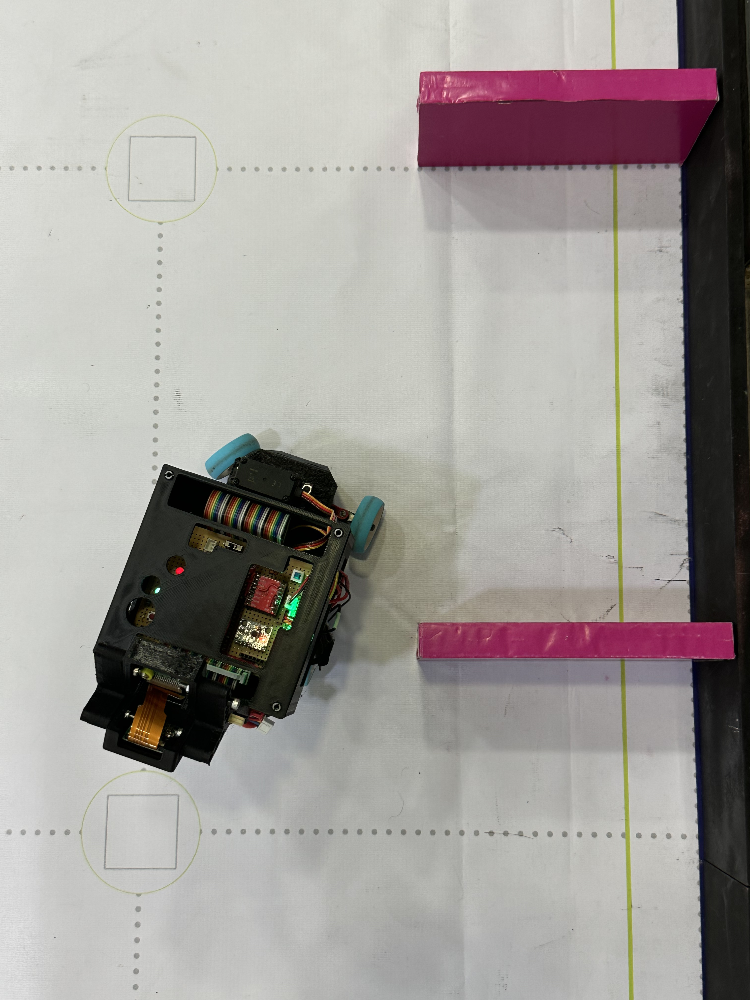
</p>

The parking subsystem is **not presented in this repository as a fully validated final challenge sequence**. Development and testing evidence are retained so that the current implementation, observations, and remaining work are traceable.

Where challenge performance tables or videos exclude parking, they should be interpreted as measuring the completed sequence **up to the parking stage or parking approach**, rather than as proof of a complete run including parallel parking.

This distinction is important for configuration honesty:

> A working Open Challenge and a working obstacle-navigation sequence do not by themselves prove a fully completed Obstacle Challenge with parking.

The current parking implementation and its development evidence remain available for inspection and further improvement.

---

# Power and Electronics

The electrical system distributes power to the Raspberry Pi and logic electronics separately from the motor-control branch.

<p align="center">

</p>

The electronics enclosure protects and organises the internal components.

<table>
<tr>
<td width="50%" align="center">
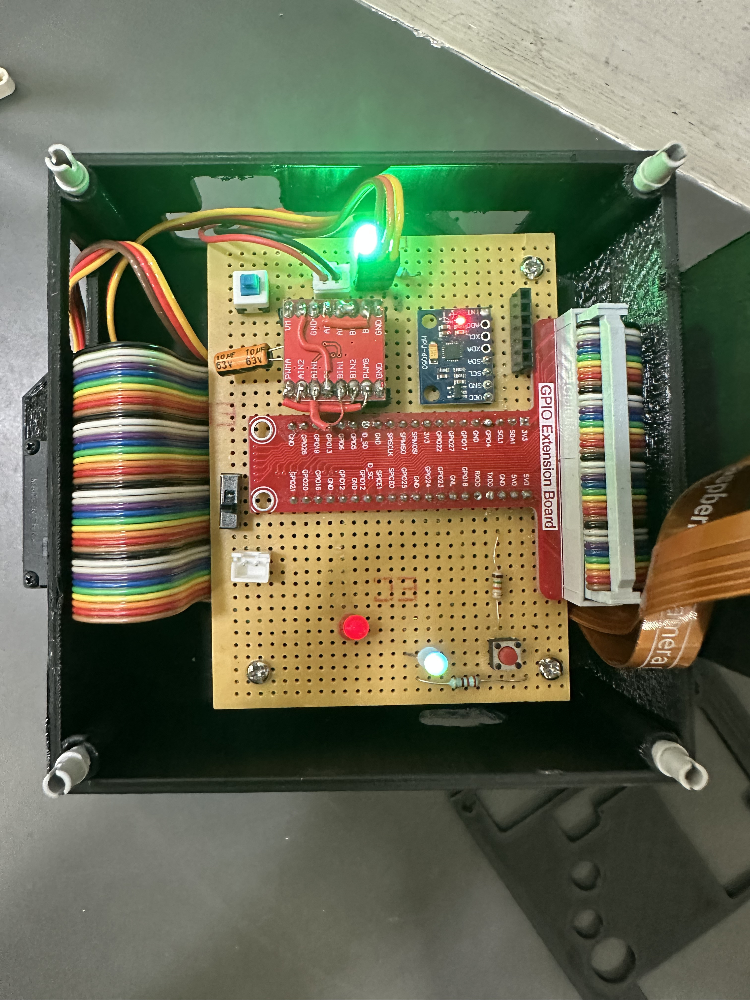
<br><b>Electronics enclosure — open</b>
</td>
<td width="50%" align="center">
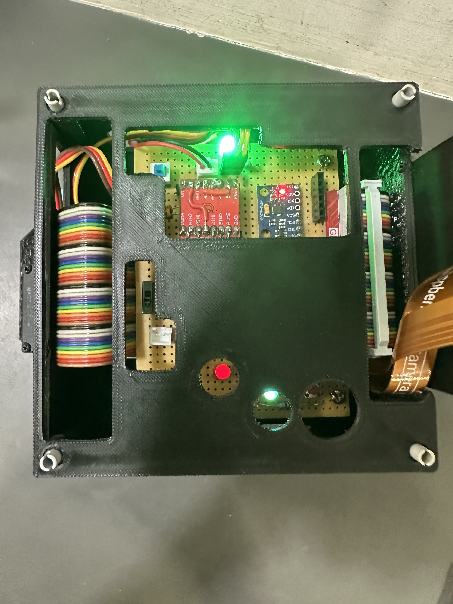
<br><b>Electronics enclosure — closed</b>
</td>
</tr>
</table>

The battery installation is shown below.

<p align="center">
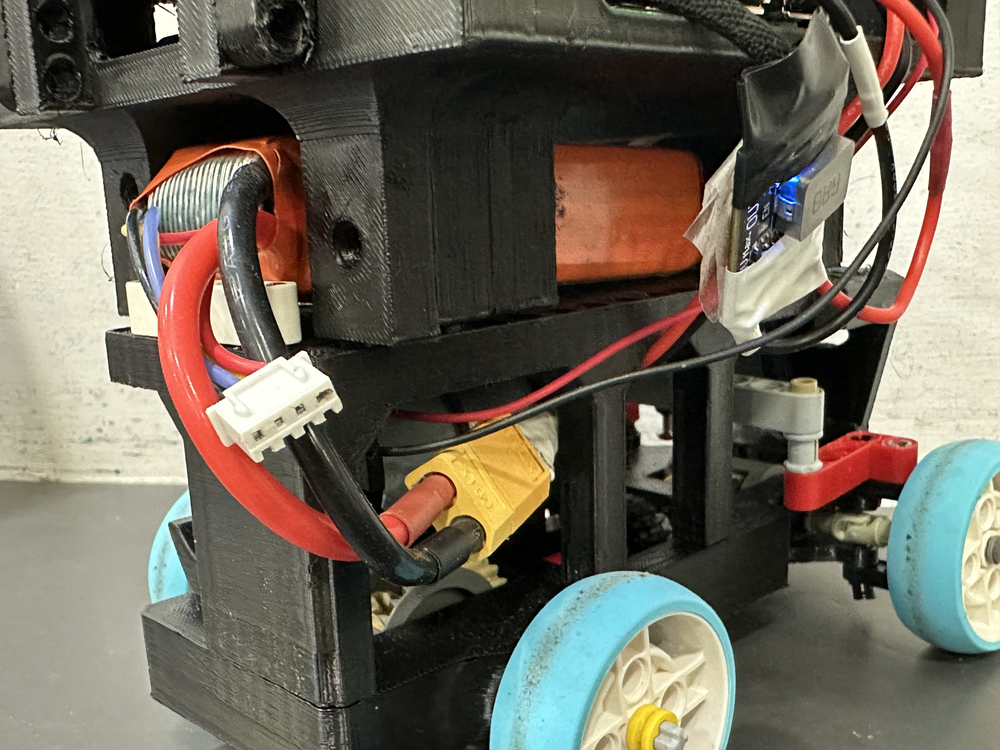
</p>

The final electrical schematic is the primary visual reference for power distribution and signal connections:

<p align="center">
<a href="schemes/schematic.jpg">
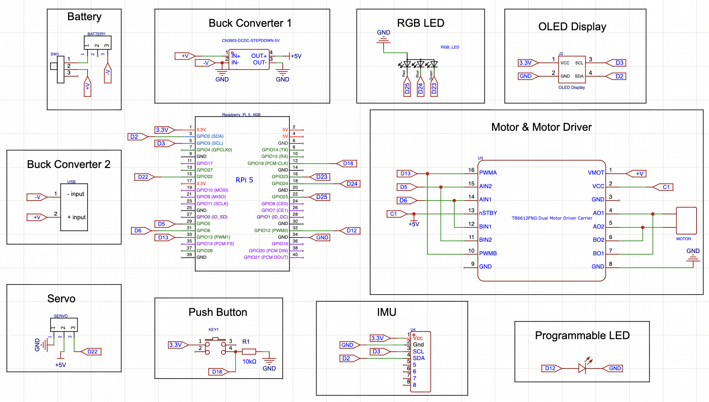
</a>
</p>

For detailed electrical reproduction, use:

- [`schemes/schematic.jpg`](schemes/schematic.jpg)
- [`guide/WIRING_AND_PIN_REFERENCE.md`](guide/WIRING_AND_PIN_REFERENCE.md)
- [`guide/POWER_AND_SENSOR_EVIDENCE.md`](guide/POWER_AND_SENSOR_EVIDENCE.md)
- [`testing/power_measurements.csv`](testing/power_measurements.csv)

Measured voltages and any current values that were not directly measured are explicitly distinguished in the power evidence rather than being presented as equivalent measurements.

---

# Testing and Validation

Testing evidence is stored in [`testing/`](testing/).

The validation workflow is:

```text
Problem
    ↓
Hypothesis
    ↓
Engineering change
    ↓
Test
    ↓
Measured result
    ↓
Decision
```

## Test records

| File | Evidence |
|---|---|
| [`test_results.csv`](testing/test_results.csv) | Individual Open Challenge and Obstacle Challenge runs, times, and observations. |
| [`test_summary.md`](testing/test_summary.md) | Human-readable summary of challenge results and processing observations. |
| [`engineering_evolution.md`](testing/engineering_evolution.md) | Problems encountered, engineering changes, tests, and resulting decisions. |
| [`power_measurements.csv`](testing/power_measurements.csv) | Measured voltage data and explicit identification of current values that were not directly measured. |
| [`processing_observations.csv`](testing/processing_observations.csv) | Camera FPS, processing loop rate, capture latency, and processing latency observations. |
| [`Open_Challenge.mp4`](testing/Open_Challenge.mp4) | Open Challenge test video stored with testing evidence. |

## Interpreting results correctly

A result is meaningful only within its recorded configuration and conditions. Battery condition, robot configuration, software version, challenge direction, obstacle placement, and test procedure can affect results.

Therefore:

- measurements from different hardware configurations are not automatically treated as identical trials;
- different obstacle placements are not treated as identical challenge conditions;
- configured target rates are not treated as identical to measured end-to-end rates;
- unmeasured current estimates are not presented as direct measurements; and
- performance evidence that excludes parking is not presented as proof of a complete parked sequence.

This distinction is part of the repository's reproducibility standard.

---

# Engineering Evolution

The robot developed through multiple iterations of mechanical, electrical, perception, and software design.

The visual progression is documented from the earlier development platforms to the final robot:

<p align="center">


</p>

The complete engineering record is maintained in [`testing/engineering_evolution.md`](testing/engineering_evolution.md).

This file should be used to trace the important design changes, including mechanical redesign, camera changes, power architecture, steering calibration, vision development, and parking development.

---

# Quick Start

> The exact Raspberry Pi OS version should be confirmed from the final physical robot before a clean reproduction is declared complete.

## 1. Start with the repository guide

Read:

[`guide/START_HERE.md`](guide/START_HERE.md)

This provides the recommended reading order and repository map.

## 2. Obtain the required components

Use:

[`guide/PARTS_AND_PURCHASE_LINKS.md`](guide/PARTS_AND_PURCHASE_LINKS.md)

and verify the final component list against:

[`guide/PARTS_CHECKLIST.md`](guide/PARTS_CHECKLIST.md)

If one file is explicitly designated as the authoritative final list in the repository, that designation should take precedence.

## 3. Build the mechanical platform

Follow:

[`guide/BUILD_FROM_ZERO.md`](guide/BUILD_FROM_ZERO.md)

Download the manufactured part files from:

[`models/`](models/)

Use the documented printing settings in:

[`guide/3D_PRINTING_SETTINGS.md`](guide/3D_PRINTING_SETTINGS.md)

## 4. Complete the electrical system

Use:

- [`schemes/schematic.jpg`](schemes/schematic.jpg)
- [`guide/WIRING_AND_PIN_REFERENCE.md`](guide/WIRING_AND_PIN_REFERENCE.md)

The schematic and pin reference should be checked together rather than treating one image as a complete substitute for the detailed wiring guide.

## 5. Prepare the Raspberry Pi

The source uses:

- Raspberry Pi 5;
- Raspberry Pi Camera Module 3 cameras;
- Python;
- OpenCV;
- NumPy;
- Picamera2;
- `RPi.GPIO`;
- `smbus2`; and
- I2C communication with the MPU6050.

The complete setup procedure belongs in:

[`guide/SOFTWARE_SETUP.md`](guide/SOFTWARE_SETUP.md)

To enable I2C on a fresh Raspberry Pi OS installation:

```bash
sudo raspi-config
```

Then select:

```text
Interface Options → I2C → Enable
```

Reboot after enabling the interface.

The exact Raspberry Pi OS release used for the final configuration can be checked with:

```bash
cat /etc/os-release
```

That version should be copied into the software setup documentation only after it is verified on the physical robot.

## 6. Calibrate and test

Before a challenge run:

1. verify both camera connections;
2. verify I2C communication with the MPU6050;
3. calibrate steering;
4. calibrate the gyro bias and heading behaviour;
5. verify colour-detection thresholds;
6. perform a stationary motor and steering test;
7. perform an Open Challenge test;
8. perform an Obstacle Challenge test; and
9. compare observations with the records in [`testing/`](testing/).

---

# Repository Structure

```text
Team-Current-WRO-FE-2026/
├── README.md
├── CHANGELOG.md
├── .gitattributes
├── .gitignore
│
├── guide/
│   ├── 3D_PRINTING_SETTINGS.md
│   ├── BUILD_FROM_ZERO.md
│   ├── PARTS_AND_PURCHASE_LINKS.md
│   ├── PARTS_CHECKLIST.md
│   ├── POWER_AND_SENSOR_EVIDENCE.md
│   ├── REPRODUCIBILITY_AND_RELEASE_EVIDENCE.md
│   ├── SOFTWARE_SETUP.md
│   ├── START_HERE.md
│   └── WIRING_AND_PIN_REFERENCE.md
│
├── models/
├── schemes/
├── src/
├── testing/
├── t-photos/
├── v-photos/
└── video/
```

## Judge reading path

The recommended path through the repository is:

```text
README.md
→ guide/START_HERE.md
→ guide/BUILD_FROM_ZERO.md
→ guide/PARTS_AND_PURCHASE_LINKS.md
→ guide/WIRING_AND_PIN_REFERENCE.md
→ guide/SOFTWARE_SETUP.md
→ src/
→ models/
→ schemes/schematic.jpg
→ v-photos/
→ testing/
→ video/
→ CHANGELOG.md
```

---

# Detailed Repository Map

## `guide/`

| File | Purpose |
|---|---|
| [`START_HERE.md`](guide/START_HERE.md) | Recommended reading order and repository map. |
| [`BUILD_FROM_ZERO.md`](guide/BUILD_FROM_ZERO.md) | Robot assembly from the parts through testing priorities. |
| [`PARTS_AND_PURCHASE_LINKS.md`](guide/PARTS_AND_PURCHASE_LINKS.md) | Required components and purchase references. |
| [`PARTS_CHECKLIST.md`](guide/PARTS_CHECKLIST.md) | Component checklist. |
| [`WIRING_AND_PIN_REFERENCE.md`](guide/WIRING_AND_PIN_REFERENCE.md) | Power architecture, GPIO assignments, motor-driver connections, servo connection, I2C devices, cameras, steering values, and measured voltages. |
| [`SOFTWARE_SETUP.md`](guide/SOFTWARE_SETUP.md) | Raspberry Pi setup, dependencies, cameras, I2C, source map, calibration, run order, and safety instructions. |
| [`POWER_AND_SENSOR_EVIDENCE.md`](guide/POWER_AND_SENSOR_EVIDENCE.md) | Power branches, voltage evidence, current limitations, sensor selection, calibration, and interference considerations. |
| [`3D_PRINTING_SETTINGS.md`](guide/3D_PRINTING_SETTINGS.md) | Manufacturing settings for custom printed components. |
| [`REPRODUCIBILITY_AND_RELEASE_EVIDENCE.md`](guide/REPRODUCIBILITY_AND_RELEASE_EVIDENCE.md) | Configuration baseline, clean-build workflow, evidence mapping, and release discipline. |

## `models/`

| STL file | Purpose |
|---|---|
| [`chassis.stl`](models/chassis.stl) | Main custom printed chassis. |
| [`chassis pt2.stl`](models/chassis%20pt2.stl) | Additional chassis component. |
| [`dual_camera_mount.stl`](models/dual_camera_mount.stl) | Dual-camera mounting structure. |
| [`camera case.stl`](models/camera%20case.stl) | Camera enclosure. |
| [`Circuit_Box.stl`](models/Circuit_Box.stl) | Electronics enclosure. |
| [`Circuit_Box_LID.stl`](models/Circuit_Box_LID.stl) | Electronics-enclosure lid. |
| [`36t gear.stl`](models/36t%20gear.stl) | Custom 36-tooth drive gear. |

## `schemes/`

| File | Purpose |
|---|---|
| [`schematic.jpg`](schemes/schematic.jpg) | Final electrical schematic and primary visual reference for power and signal connections. |

## `src/`

The executable source code is described in the [Software Architecture](#software-architecture) section above.

## `testing/`

The testing records are described in the [Testing and Validation](#testing-and-validation) section above.

## `t-photos/`

Contains team and individual photographs used in the [Team](#the-team) section.

## `v-photos/`

Contains CAD previews, robot photographs, mechanical evidence, camera/perception evidence, power/electronics evidence, and challenge-testing photographs.

## `video/`

Contains additional local challenge video evidence and [`yt_video_link.md`](video/yt_video_link.md), which identifies the external YouTube video evidence.

---

# Reproducibility

The repository is intended to allow another team or reviewer to trace the final robot from design through validation.

A reproducible reconstruction should be able to follow:

```text
Parts
  ↓
CAD/STL manufacturing
  ↓
Mechanical assembly
  ↓
Electrical schematic and pin wiring
  ↓
Raspberry Pi and software setup
  ↓
Sensor and steering calibration
  ↓
Source-code execution
  ↓
Challenge testing
  ↓
Comparison with recorded evidence
```

The detailed reproducibility procedure is maintained in:

[`guide/REPRODUCIBILITY_AND_RELEASE_EVIDENCE.md`](guide/REPRODUCIBILITY_AND_RELEASE_EVIDENCE.md)

The most important reproducibility principle is:

> **The README, engineering journal, guide files, source code, CAD/STL files, schematic, testing records, and changelog must describe the same final robot configuration. If a parameter or hardware component changes during development, the corresponding source, test record, and documentation are updated together before the configuration is called final.**

The repository therefore treats documentation as part of the engineering configuration rather than as a separate description written after development.

---

# Failure Modes and Mitigation

| Failure mode | Mitigation or engineering response |
|---|---|
| IMU or I2C communication failure | Stop or prevent an uncontrolled manoeuvre according to the implemented safety behaviour. |
| Duplicate marker detection | Use rising-edge detection and a cooldown period. |
| Camera exposure variation | Use the documented exposure and camera configuration procedures. |
| False colour detection | Use colour masks, morphology, contour filtering, geometry/confidence logic, and challenge-specific validation. |
| Motor stall or excessive current | Use the documented motor/power configuration and distinguish measured electrical values from estimates. |
| Excessive speed or wheel lift | Tune operating speed for stability rather than relying on theoretical maximum motor RPM. |
| Wall collision | Record the remaining risk and refine direction-dependent navigation and steering behaviour. |
| Low battery condition | Verify battery condition and documented voltage thresholds before testing. |
| Parking instability | Treat parking as a separate development limitation until the complete sequence is validated. |

Failure handling and engineering limitations should remain consistent across the source code, test records, README, and engineering journal.

---

# Evidence Index

## Final robot and development

- [`IMG_01_V1_LEGO_ROBOT.jpg`](v-photos/IMG_01_V1_LEGO_ROBOT.jpg)
- [`IMG_02_V2_HYBRID_ROBOT.JPG`](v-photos/IMG_02_V2_HYBRID_ROBOT.JPG)
- [`IMG_03_FINAL_ROBOT_FRONT.jpg`](v-photos/IMG_03_FINAL_ROBOT_FRONT.jpg)
- [`IMG_04_FINAL_ROBOT_REAR.jpg`](v-photos/IMG_04_FINAL_ROBOT_REAR.jpg)
- [`IMG_05_FINAL_ROBOT_TOP.jpg`](v-photos/IMG_05_FINAL_ROBOT_TOP.jpg)
- [`SIDE_PROFILE_1.png`](v-photos/SIDE_PROFILE_1.png)
- [`SIDE_PROFILE_2.png`](v-photos/SIDE_PROFILE_2.png)

## Mechanical evidence

- [`IMG_06_MECHANICAL_DIFFERENTIAL.jpg`](v-photos/IMG_06_MECHANICAL_DIFFERENTIAL.jpg)
- [`IMG_07_DIFFERENTIAL_POWERTRAIN.jpg`](v-photos/IMG_07_DIFFERENTIAL_POWERTRAIN.jpg)
- [`IMG_08_STEERING_MECHANISM.jpg`](v-photos/IMG_08_STEERING_MECHANISM.jpg)
- [`IMG_09_MOTOR_MOUNT.jpg`](v-photos/IMG_09_MOTOR_MOUNT.jpg)

## Camera and perception evidence

- [`IMG_10_CAMERA_CONFIGURATION.jpg`](v-photos/IMG_10_CAMERA_CONFIGURATION.jpg)
- [`IMG_11_CAMERA_MOUNT_ADJUSTMENT.jpg`](v-photos/IMG_11_CAMERA_MOUNT_ADJUSTMENT.jpg)
- [`IMG_12_CAMERA_VIEW_FORWARD.jpg`](v-photos/IMG_12_CAMERA_VIEW_FORWARD.jpg)
- [`IMG_13_CAMERA_VIEW_OBSTACLE.jpg`](v-photos/IMG_13_CAMERA_VIEW_OBSTACLE.jpg)
- [`IMG_14_CAMERA_VIEW_PARKING.jpg`](v-photos/IMG_14_CAMERA_VIEW_PARKING.jpg)
- [`IMG_15_BLACK_MASK.jpg`](v-photos/IMG_15_BLACK_MASK.jpg)
- [`IMG_17_CONTOUR_DETECTION.jpg`](v-photos/IMG_17_CONTOUR_DETECTION.jpg)
- [`IMG_18_OBSTACLE_DETECTION.jpg`](v-photos/IMG_18_OBSTACLE_DETECTION.jpg)

## Power and electronics evidence

- [`IMG_20_POWER_DISTRIBUTION.jpg`](v-photos/IMG_20_POWER_DISTRIBUTION.jpg)
- [`IMG_21_CIRCUIT_BOX_OPEN.jpg`](v-photos/IMG_21_CIRCUIT_BOX_OPEN.jpg)
- [`IMG_22_CIRCUIT_BOX_CLOSED.jpg`](v-photos/IMG_22_CIRCUIT_BOX_CLOSED.jpg)
- [`IMG_23_BATTERY_SETUP.jpg`](v-photos/IMG_23_BATTERY_SETUP.jpg)

## Challenge and parking evidence

- [`IMG_26_OPEN_CHALLENGE_TEST.jpg`](v-photos/IMG_26_OPEN_CHALLENGE_TEST.jpg)
- [`IMG_27_OBSTACLE_CHALLENGE_TEST.jpg`](v-photos/IMG_27_OBSTACLE_CHALLENGE_TEST.jpg)
- [`IMG_28_PARKING_TEST.jpg`](v-photos/IMG_28_PARKING_TEST.jpg)

## Team evidence

- [`Darsh_Individual.png`](t-photos/Darsh_Individual.png)
- [`Ehan_Individual.png`](t-photos/Ehan_Individual.png)
- [`Team.png`](t-photos/Team.png)
- [`sunil_sir.jpg`](t-photos/sunil_sir.jpg)
- [`shyam_sir.jpg`](t-photos/shyam_sir.jpg)

---

# Configuration Consistency

Before a configuration is described as final, verify:

| Check | Required result |
|---|---|
| README links | Every link opens an existing file or directory. |
| Image paths | Capitalisation and extensions match the repository exactly. |
| Source map | Every listed Python file exists and has the described purpose. |
| Guide map | Every guide link uses the actual current filename. |
| Schematic | Uses [`schemes/schematic.jpg`](schemes/schematic.jpg). |
| Software values | README values match the actual final source code. |
| Test values | Documentation matches the CSV records and labels the relevant conditions. |
| Camera configuration | Resolution and target/observed performance are not confused. |
| Parking status | Remaining limitations are stated consistently across all evidence. |
| Electrical evidence | Measured values and estimates are explicitly distinguished. |
| Final baseline | A specific final commit or tag identifies the Nationals configuration. |

Generated Python files such as `__pycache__/` and `*.pyc` should remain excluded through `.gitignore` and should not be treated as final reproducibility evidence.

---

# Version and Release

This README describes the repository structure and robot configuration represented by the project baseline.

The repository development history is recorded in:

[`CHANGELOG.md`](CHANGELOG.md)

The final Nationals configuration should be frozen at one identifiable Git commit or tag before submission. That release identity should be recorded consistently in:

- the GitHub repository;
- the changelog;
- the reproducibility/release guide; and
- any final engineering documentation that identifies a fixed configuration.

Meaningful commits make the engineering history easier to trace. Examples include:

```text
mechanical: revise camera mount
vision: improve obstacle confidence
drive: update steering limits
testing: record obstacle challenge runs
docs: update Nationals configuration
```

The repository should not rely on a moving `main` branch alone to identify a final competition configuration once submission evidence is frozen.

---

# Repository Navigation

**Start here:**

➡️ [`guide/START_HERE.md`](guide/START_HERE.md)

Then follow:

**Build** → [`guide/BUILD_FROM_ZERO.md`](guide/BUILD_FROM_ZERO.md)  
**Parts** → [`guide/PARTS_AND_PURCHASE_LINKS.md`](guide/PARTS_AND_PURCHASE_LINKS.md)  
**Wiring** → [`guide/WIRING_AND_PIN_REFERENCE.md`](guide/WIRING_AND_PIN_REFERENCE.md)  
**Software** → [`guide/SOFTWARE_SETUP.md`](guide/SOFTWARE_SETUP.md)  
**Source code** → [`src/`](src/)  
**CAD/STL files** → [`models/`](models/)  
**Electrical schematic** → [`schemes/schematic.jpg`](schemes/schematic.jpg)  
**Robot evidence** → [`v-photos/`](v-photos/)  
**Testing evidence** → [`testing/`](testing/)  
**Video evidence** → [`video/`](video/)  
**Development history** → [`CHANGELOG.md`](CHANGELOG.md)

---

<p align="center">
  <b>Team Current</b><br>
  <i>The Dark Knight — WRO Future Engineers 2026</i>
</p>
