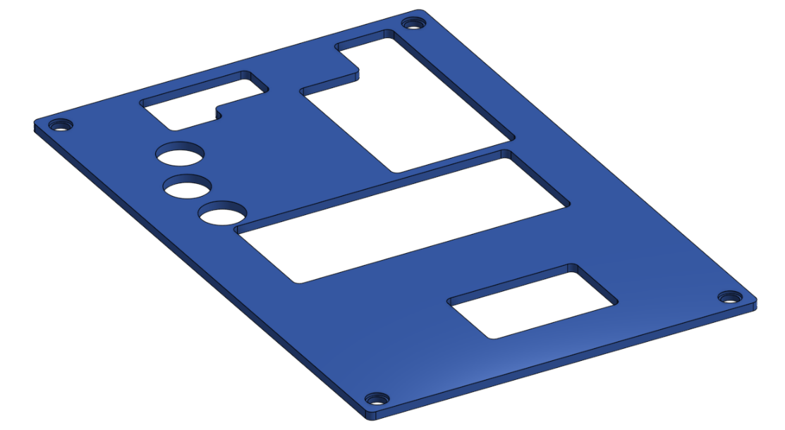

# The Dark Knight
## WRO Future Engineers 2026 — Team Current
### v1.0 — Nationals Configuration

This is the GitHub repository for **The Dark Knight**, our WRO Future Engineers 2026 robot.

We keep the code, CAD, photos, testing material and engineering documentation here so the Nationals version can be checked from one place. The latest engineering document is the main reference for the current design and its limitations.

## Table of Contents

- [1. Team](#1-team)
- [2. Final Robot Overview](#2-final-robot-overview)
- [3. Robot and CAD Visual Reference](#3-robot-and-cad-visual-reference)
  - [Final STL Files](#final-stl-files)
- [4. Final Robot Specifications](#4-final-robot-specifications)
- [5. Mechanical Design](#5-mechanical-design)
  - [5.1 CAD + LEGO hybrid architecture](#51-cad--lego-hybrid-architecture)
  - [5.2 Four-wheel drive](#52-four-wheel-drive)
  - [5.3 Mechanical differential and driveshaft](#53-mechanical-differential-and-driveshaft)
  - [5.4 Steering](#54-steering)
  - [5.5 Gear ratio](#55-gear-ratio)
- [6. Cameras and Perception](#6-cameras-and-perception)
- [7. Computer Vision](#7-computer-vision)
  - [7.1 Open Challenge processing](#71-open-challenge-processing)
  - [7.2 Obstacle Challenge processing](#72-obstacle-challenge-processing)
  - [7.3 Measured processing performance](#73-measured-processing-performance)
- [8. Steering Control](#8-steering-control)
- [9. Software Architecture](#9-software-architecture)
- [10. Open Challenge](#10-open-challenge)
  - [10.1 Direction markers](#101-direction-markers)
  - [10.2 Marker counting](#102-marker-counting)
  - [10.3 Recorded results](#103-recorded-results)
- [11. Obstacle Challenge](#11-obstacle-challenge)
- [12. Parking and MPU6050](#12-parking-and-mpu6050)
- [13. Power Architecture](#13-power-architecture)
- [14. Measured Power Results](#14-measured-power-results)
- [15. Engineering Evolution](#15-engineering-evolution)
- [16. Recorded Challenge Performance](#16-recorded-challenge-performance)
- [17. Failure Analysis and Current Risks](#17-failure-analysis-and-current-risks)
- [18. Repository Structure](#18-repository-structure)
- [19. Reproducibility](#19-reproducibility)
- [20. Evidence Included in This Repository](#20-evidence-included-in-this-repository)
- [21. Final Nationals Configuration](#21-final-nationals-configuration)
- [22. Version](#22-version)

---

# 1. Team

| Name | Role |
|---|---|
| **Darsh Makadia** | Programming & Electronics |
| **Ehan Mansuri** | Mechanical Design & 3D Modelling |
| **Sunil Solanki** | Coach |

**Robot:** The Dark Knight  
**Team:** Team Current  
**Competition:** WRO Future Engineers 2026 — Nationals  
**Category:** WRO Future Engineers

---

# 2. Final Robot Overview

The Dark Knight is our autonomous WRO Future Engineers robot. The final design combines a **CAD/PLA chassis**, LEGO mechanical drivetrain parts, **four-wheel drive**, a **mechanical differential on each axle**, servo steering and a two-camera vision system.

The final main hardware is:

- Raspberry Pi 5, 4 GB
- 2 × Raspberry Pi Camera Module 3
- JGB37-520 DC motor, 12 V, 600 RPM
- Servo steering
- MPU6050 IMU
- TB6612FNG motor driver
- 3S LiPo, 11.1 V nominal, 2200 mAh
- CAD/PLA structural parts
- LEGO Technic drivetrain components
- Two mechanical LEGO differentials connected through the central driveshaft

The robot reached this configuration through several iterations. The document records the earlier LEGO-heavy version, the LEGO/CAD hybrid version, the motor and power changes, the camera changes, and the software changes that followed testing.

---

# 3. Robot and CAD Visual Reference

The robot photos are kept in `photos/` and the CAD previews are in `models/`. The actual printable STL files remain in `cad/`.

## Robot Photos

### Front View


### Back View


### Side Views

<p align="center">
  
  
</p>

### Motor and Steering

<p align="center">
  
  
</p>

### Differential and Electronics

<p align="center">
  
  
</p>

### Electronics From Above

<p align="center">
  
</p>

## CAD Models

### Final Chassis


### Circuit Box


### Circuit Box Lid



### Camera Mount


### Camera Case


## Circuit Schematic


## Final STL Files

The final STL exports are in [`cad/`](./cad/). These are the actual STL files supplied with this version.

| Model | STL file | Purpose |
|---|---|---|
| Final chassis | [`final_chassis.stl`](./cad/final_chassis.stl) | Main custom chassis |
| Final chassis — Part 2 | [`final_chassis_part2.stl`](./cad/final_chassis_part2.stl) | Additional chassis component |
| Dual-camera mount | [`dual_camera_mount.stl`](./cad/dual_camera_mount.stl) | Camera mounting component |
| Camera case | [`camera_case.stl`](./cad/camera_case.stl) | Camera protection/enclosure |
| Circuit box | [`circuit_box.stl`](./cad/circuit_box.stl) | Electronics enclosure |
| Circuit box lid | [`circuit_box_lid.stl`](./cad/circuit_box_lid.stl) | Electronics enclosure lid |

---

# 4. Final Robot Specifications

| Specification | Final value |
|---|---:|
| Length | **24 cm** |
| Width | **13 cm** |
| Height | **27.5 cm** |
| Mass | **863 g** |
| Wheel diameter | **43.2 mm** |
| Gear ratio | **20:36 (1:1.8 overdrive)** |
| Drive configuration | **4WD** |
| Differential | **2 mechanical LEGO differentials, one per axle** |
| Drive motor | **JGB37-520 DC 12 V, 600 RPM** |
| Steering | **Servo steering** |
| Main computer | **Raspberry Pi 5, 4 GB** |
| Cameras | **2 × Raspberry Pi Camera Module 3** |
| Orientation sensor | **MPU6050** |
| Motor driver | **TB6612FNG** |
| Battery | **3S LiPo, 2200 mAh, 11.1 V nominal** |
| Structural material | **PLA / CAD printed parts** |

---

# 5. Mechanical Design

## 5.1 CAD + LEGO hybrid architecture

We used CAD and LEGO for different parts of the robot instead of trying to make everything from one system.

**CAD/PLA:** chassis, camera mount, camera case, electronics box, electronics-box lid, upper chassis base and the custom 36-tooth gear.

**LEGO Technic:** drivetrain parts, gears, axles, connectors and the mechanical differentials.

This gave us a rigid custom structure without redesigning LEGO parts that already worked well for the drivetrain.

## 5.2 Four-wheel drive

The final robot is **four-wheel drive**. One drive motor powers the drivetrain, which sends rotation through the central driveshaft to the front and rear axle differentials.

The 4WD decision was mainly useful for the large steering angles used during parking. Powering the steered wheels helps reduce the tendency to push sideways during sharp turns.

## 5.3 Mechanical differential and driveshaft

The final drivetrain uses **two LEGO mechanical differentials, one on each axle**. The motor sends power through the central driveshaft, and bevel gears transfer that rotation to the axle differentials.

We kept this mechanical solution instead of designing an electronic differential. It gave us the required wheel-speed difference during turns while keeping the drivetrain modular.

## 5.4 Steering

The robot uses servo steering. The experimentally tuned Open Challenge values are:

- **Centre: 75°**
- **Minimum: 35°**
- **Maximum: 115°**

These are calibration values for our actual steering mechanism, not values copied directly from the servo datasheet.

## 5.5 Gear ratio

The external gear pair uses a custom **36-tooth gear** and a LEGO **20-tooth gear**, giving a **1:1.8 overdrive**.

The purpose was to increase wheel speed rather than maximise torque. The document records a measured speed of about **1.33 m/s (4.8 km/h)** over a 3 m test in 2.25 s, while later Open Challenge testing at the selected operating conditions gave about **0.93 m/s** from the 28 s three-lap result.

---

# 6. Cameras and Perception

The final robot uses **two Raspberry Pi Camera Module 3 cameras**.

### Front camera

Used mainly for track boundaries, blue/orange direction markers and red/green obstacle perception.

- Resolution: **1480 × 520**
- Target: **60 FPS**
- Lens-centre height: **25.0 cm**

### Rear / parking camera

Used mainly for the parking area and magenta/purple parking-structure detection.

- Resolution: **640 × 480**
- Target: **60 FPS**
- Lens-centre height: **23.5 cm**

The two-camera arrangement came from testing. The front camera needs to see the track and obstacles, while the parking sequence needs useful rearward visual information.

---

# 7. Computer Vision

## 7.1 Open Challenge processing

The Open Challenge currently uses direct colour segmentation and contour analysis:

`Camera frame → HSV conversion → colour mask → opening/closing → contours → target point`

The front camera is processed at **1480 × 520**, with a configured target of 60 FPS. Recorded on-robot tests operated at approximately **14 FPS**.

## 7.2 Obstacle Challenge processing

The Obstacle Challenge uses the front camera with a lower region excluded to reduce false detections from the robot body. Candidate detections use:

- HSV colour coverage
- LAB colour consistency
- contour geometry / rectangularity
- minimum area
- temporal confirmation

The documented confidence calculation is:

`C = 0.65 C_HSV + 0.20 C_LAB + 0.15 C_geometry`

The observed obstacle-processing loop in the recorded tests was approximately **11 FPS**.

## 7.3 Measured processing performance

These are observed samples from the current on-robot test overlays, not guaranteed FPS values for every run.

| Challenge | Mean camera FPS | Mean loop FPS | Mean capture latency | Mean loop/processing latency |
|---|---:|---:|---:|---:|
| Obstacle | 11.22 | 11.25 | 1.95 ms | 84.23 ms |
| Open | 14.1 | 14.1 | 1.7 ms | 61.5 ms |

The configured camera target remains 60 FPS. The lower observed processing rates are due to the processing/control workload.

---

# 8. Steering Control

The Open Challenge uses proportional steering:

`θ = θc + KP × e`

with **KP = 0.013** in the documented configuration.

The controller handles two-wall, one-wall and no-wall cases. The steering output is limited by the calibrated physical range of **35°–115°**, with **75°** as centre.

The steering values are an important mechanical/software interface: the usable software range is limited by the actual servo and steering mechanism.

---

# 9. Software Architecture

The software is written in Python and is organised around separate modules for:

- camera acquisition
- vision processing
- drive control
- steering
- heading/IMU
- Open Challenge
- Obstacle Challenge
- parking
- configuration

Important configuration values are kept in `code/config.py`.

The documented Open Challenge values include:

```text
LAPS_TO_COMPLETE = 3
LINES_PER_LAP = 4
LINE_COOLDOWN = 1.0
KP = 0.013
CENTER = 75
LEFT = 35
RIGHT = 115
```

The source code in `code/` is the implementation reference for exact thresholds and challenge behaviour.

---

# 10. Open Challenge

## 10.1 Direction markers

The first valid direction marker determines the direction:

- **Blue → anticlockwise**
- **Orange → clockwise**

After the direction is known, the program counts the relevant marker colour instead of continuously counting both colours.

## 10.2 Marker counting

The documented configuration is:

- **3 laps**
- **4 relevant crossings per lap**
- **12 total counted crossings**
- **1.0 s cooldown**
- rising-edge detection so one physical marker is not counted repeatedly across consecutive frames

## 10.3 Recorded results

Six complete anticlockwise Open Challenge runs were recorded:

| Run | Time |
|---:|---:|
| 1 | 32 s |
| 2 | 30 s |
| 3 | 28 s |
| 4 | 28 s |
| 5 | 28 s |
| 6 | 28 s |

**Best recorded time: 28 s.**

The repeated 28-second runs show repeatability under the tested conditions, but this small dataset is not presented as a statistically established performance figure.

---

# 11. Obstacle Challenge

The Obstacle Challenge adds red and green obstacle detection to the normal track/navigation system.

Obstacle targets are given priority over ordinary wall-following. The steering response is direction-dependent because the robot has to choose a path around the detected obstacle.

The system also uses temporal confirmation so a single bad camera frame is less likely to trigger an immediate avoidance manoeuvre.

The recorded obstacle-navigation times below cover the sequence **up to the parking approach**. They do **not** include a successful final parking manoeuvre.

---

# 12. Parking and MPU6050

The parking subsystem is **implemented and physically tested**, but the latest engineering document does **not** describe the complete parking manoeuvre as reliable yet.

The current setup uses:

- rear Raspberry Pi Camera Module 3
- magenta/purple parking-structure detection
- explicit parking states
- MPU6050 gyroscope heading feedback

At startup the MPU6050 performs a stationary Z-axis gyro calibration using **1500 samples** after an initial settling period. The bias is subtracted from later readings and the corrected angular velocity is integrated into a 0–360° heading.

The parking state sequence uses the heading to decide when the required orientation has been reached.

### Current parking status

The implementation has been physically tested, but the final parking manoeuvre **does not yet consistently reach the required final position and alignment without contact with the parking structures**.

The remaining work is calibration of:

- turn sequence
- IMU heading thresholds
- visual position thresholds

This distinction matters: **parking is implemented and tested, but it is not being claimed as a reliably completed final sequence yet.**

---

# 13. Power Architecture

The robot uses a **3S LiPo, 11.1 V nominal, 2200 mAh** battery.

The power system is split into separate branches:

- raw battery → motor-driver VMOT / drive motor
- Buck 1 → regulated 5 V servo + motor-driver logic
- Buck 2 → regulated 5 V Raspberry Pi supply
- Raspberry Pi → 3.3 V devices such as the MPU6050 and OLED

The Pi is therefore not used as the power source for the motor system.

The final schematic is in `schematics/`.

---

# 14. Measured Power Results

These are the voltage measurements documented from testing:

| Measurement point | Condition | Value |
|---|---|---:|
| LiPo battery | Before run | **11.1 V** |
| LiPo battery | After multiple runs | **10.8 V** |
| Buck 1 output | Motors OFF | **5.0 V** |
| Buck 1 output | Robot moving | **5.0 V** |
| Pi supply | Idle | **5.0 V** |
| Pi supply | Moving | **5.0 V** |
| Motor driver | Motors OFF | **11.1 V** |
| Motor driver | Motors ON | **10.8 V** |

A full bench current-logging setup was not available, so the README does **not** invent a measured current value. Current-related load figures in the engineering document are clearly identified as datasheet-based estimates.

---

# 15. Engineering Evolution

| Area | Problem observed | What changed | Testing / evidence | Result |
|---|---|---|---|---|
| Motor | Stalling/current and stability concerns | Johnson 1000 RPM → JGB37-520 600 RPM | Motor and drive testing | Lower-risk final motor |
| Chassis | LEGO-heavy structure limited rigidity/custom mounting | CAD/PLA structure introduced | Mechanical iterations + final measurement | 24 × 13 × 27.5 cm, 863 g |
| Camera | Early LEGO mount was wobbly; placement affected perception | CAD mount + two-camera architecture | Camera placement and vision tests | More stable forward/rear perception |
| Power | Pi should not supply motor system | Separate motor and regulated branches | Multimeter voltage measurements | Stable measured voltages at tested points |
| Navigation | One marker could appear in several frames | Rising-edge + 1 s cooldown | Repeated Open runs | Reduced duplicate counting |
| Obstacle avoidance | Colour/position errors could cause late steering | HSV + LAB + geometry + contour filtering + temporal confirmation | Obstacle runs | Improved obstacle navigation up to parking approach |
| Parking | Timed turns did not provide enough orientation information | Rear camera + parking states + MPU6050 heading | Separate parking tests | Implemented and tested, but final manoeuvre still needs calibration for reliable completion |

---

# 16. Recorded Challenge Performance

## Open Challenge

**32, 30, 28, 28, 28, 28 s**  
**Best: 28 s**

## Obstacle Challenge navigation

**1:10, 1:09, 1:11, 1:20, 1:15, 1:13**  
**Best: 1:09**

The obstacle times are for autonomous navigation **up to the parking approach**. Obstacle placement varied slightly between runs, so these are not treated as perfectly identical trials.

The final parking manoeuvre was tested separately and is not included in these six timed obstacle results.

---

# 17. Failure Analysis and Current Risks

The main failures and current risks recorded by the team are:

- **Motor stalling:** addressed by replacing the earlier motor with the JGB37-520.
- **Camera mount wobble:** addressed with the CAD mount.
- **Poor obstacle visibility:** addressed by lowering/adjusting the camera.
- **Duplicate line detection:** reduced using rising-edge detection and cooldown.
- **High-speed instability:** observed with the earlier Johnson 1000 RPM motor; operating speed was reduced and steering was tuned.
- **Wall collisions:** still unresolved in some obstacle-oriented situations.
- **Lighting variation:** reduced using exposure/gain locking and a nearby LED, but not eliminated completely.
- **Parking reliability:** implementation exists, but final position/alignment still needs calibration.
- **Battery availability:** only one battery could be charged at a time; three batteries were available for development.
- **Battery charging incident:** one incident was observed, but the cause was not confirmed in the documentation.

The current engineering focus is therefore not simply increasing speed. The project prioritises:

**accuracy > repeatability > raw maximum speed**

---

# 18. Repository Structure

```text
Team_Currents_Nationals_v1.0/
├── README.md
├── VERSION
├── code/
├── cad/
├── models/
├── schematics/
├── schemes/
├── photos/
├── testing/
└── documentation/
```

The main project directories are:

- `code/` — challenge software and configuration
- `cad/` — actual STL exports and CAD reference images
- `schematics/` — final electrical schematic
- `photos/` — robot and development photographs
- `testing/` — results, power measurements, engineering evolution and video evidence
- `documentation/` — final engineering documentation

`models/` and `schemes/` contain README-linked visual previews for GitHub display; the source/reference files remain in `cad/` and `schematics/`.

---

# 19. Reproducibility

The main hardware needed to reproduce the final system is:

- Raspberry Pi 5, 4 GB
- 2 × Raspberry Pi Camera Module 3
- JGB37-520 12 V 600 RPM motor
- servo motor
- MPU6050
- TB6612FNG motor driver
- 3S 2200 mAh LiPo
- buck converters
- PLA printed parts
- LEGO Technic drivetrain components

The software uses the Raspberry Pi camera environment and Python libraries including OpenCV, NumPy, RPi.GPIO and Picamera2.

For exact colour thresholds and implementation values, use the source code in `code/` together with the parameter reference in the engineering document.

---

# 20. Evidence Included in This Repository

The repository contains:

- final engineering documentation PDF
- Python source code
- final STL files
- CAD preview images
- final electrical schematic preview
- robot photographs
- Open Challenge testing video
- Open Challenge and Obstacle Challenge recorded results
- power-voltage measurements
- engineering evolution notes

The engineering document also records the measured processing-performance samples, development history, risk register and final system architecture.

---

# 21. Final Nationals Configuration

The latest documented configuration is:

**Mechanical** — CAD/PLA chassis, 4WD, one drive motor, central driveshaft, two mechanical LEGO differentials, servo steering.

**Electronics** — Raspberry Pi 5 4 GB, TB6612FNG, MPU6050, 3S 2200 mAh LiPo, separate regulated power branches.

**Vision** — two Raspberry Pi Camera Module 3 cameras, front perception plus rear parking perception, OpenCV, HSV/LAB processing and contour filtering.

**Navigation** — proportional steering, direction selected from blue/orange markers, rising-edge marker counting, 1 s cooldown, 3 laps and 12 relevant crossings.

**Obstacle avoidance** — red/green detection, confidence filtering, temporal confirmation and direction-dependent steering.

**Parking** — implemented and physically tested with rear-camera perception, state-based control and MPU6050 heading feedback; final reliable completion is still being calibrated.

**Measured performance** — Open Challenge best 28 s; Obstacle Challenge navigation best 1:09 before the parking manoeuvre.

This is the current configuration documented for Nationals. Values are not presented as universal constants; they are the values tuned and tested for this version of the robot.

---

# 22. Version

**v1.0 — Nationals Configuration**

The engineering document is the current detailed record of the design. If code, hardware or testing changes after this version, the affected README, testing evidence and documentation should be updated together so that the repository does not contain conflicting descriptions.

Repository documented in the engineering document:  
https://github.com/darsh-makadia/Team-Current-WRO-FE-2026
